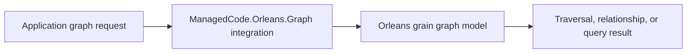

# ManagedCode.Orleans.Graph

## Trigger On

- integrating `ManagedCode.Orleans.Graph` into an Orleans-based system
- modeling graph relationships, edges, or traversal behavior with Orleans
- reviewing graph-oriented distributed workflows
- documenting how graph operations fit into an Orleans application

## Workflow

1. Confirm the application really has graph-style relationships or traversal needs.
2. Identify which graph concerns belong in the library integration:
   - node representation
   - relationship management
   - traversal or lookup patterns
3. Keep Orleans runtime concerns explicit and avoid disguising a normal CRUD model as a graph problem.
4. Document how graph operations interact with grain identity, persistence, and distributed execution.
5. Validate the actual traversal or relationship scenarios the application depends on.

## Deliver

- guidance on when Orleans.Graph is the right abstraction
- recommendations for keeping graph modeling explicit
- verification expectations for the graph flows the application actually runs

## Validate

- the application has a real graph problem, not a generic relational one
- graph integration does not blur grain identity and traversal concerns
- validation covers real traversal or relationship flows, not only setup code
